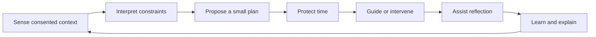

# 52 - Proactive Product Strategy

## Executive Decision

Sadhana OS should evolve from a cloud-backed spiritual wellness tracker into a
proactive personal practice coach.

The product should help a user choose, schedule, perform, recover, reflect, and
learn. Tracking remains an important record, but it becomes supporting
infrastructure rather than the primary experience.

The strategic promise is:

> Sadhana OS protects and adapts the practices that keep you grounded in real
> life.

This is a product hypothesis to validate. It is not yet a market claim.

## Current Baseline

The `v0.2.0-alpha.3` milestone provides:

- a configurable practice tracker;
- premium Today, Journal, Dashboard, History, and Settings experiences;
- cloud identity, persistence, user isolation, and resilient synchronization;
- onboarding and starter practices;
- analytics and reflection history;
- local-to-cloud migration and cloud-aware export/import;
- privacy and account controls;
- PWA, accessibility, observability, and automated quality foundations.

The current loop is predominantly reactive:

```text
Remember -> Open app -> Record behavior -> Review history
```

Its central risk is not technical quality. It is that the user must supply most
of the effort before receiving value.

## Beachhead Customer

### Primary Persona: The Intentional Achiever

The initial customer is:

- approximately 28 to 50 years old;
- a professional, founder, knowledge worker, or working parent;
- already interested in yoga, meditation, reflection, mindful communication,
  spiritual growth, or intentional living;
- comfortable using a calendar and smartphone, and possibly a wearable;
- frustrated by inconsistency rather than lack of information;
- willing to pay for time, clarity, accountability, and personalization;
- uncomfortable with noisy gamification, public social feeds, or generic
  motivational content.

### Situation

The customer usually knows what would help. The failure occurs when meetings,
travel, low energy, family obligations, digital distraction, or emotional load
disrupt the intended practice.

### Excluded Initial Segments

Sadhana OS should not initially optimize for:

- clinical diagnosis or treatment;
- crisis mental-health support;
- elite athletic performance;
- children or school monitoring;
- advanced practitioners seeking lineage-specific instruction;
- teams requiring workforce surveillance;
- users seeking only a free checklist;
- users who want a public social network.

These segments require different evidence, safety, regulation, content, or
business models.

## Jobs To Be Done

### Functional Jobs

1. Help me decide the smallest set of practices that matters today.
2. Find realistic time for those practices around my actual commitments.
3. Help me begin when I am distracted, stressed, tired, or avoiding the task.
4. Adapt the plan without making me feel that the day has failed.
5. Capture what can be known automatically and ask only what remains unknown.
6. Help me understand which practices are associated with feeling and
   functioning better.
7. Preserve a private, trustworthy record of my practice and reflection.

### Emotional Jobs

- Help me feel grounded rather than managed.
- Help me recover without guilt.
- Help me trust my data and the advice derived from it.
- Help me see progress without turning spiritual practice into competition.
- Help me feel that the product respects the seriousness of my inner life.

### Social Jobs

- Help me be more present with family and colleagues.
- Help me keep commitments made to a teacher, coach, partner, or myself.
- Let me share selected progress without exposing private reflections.

## Product Category And Positioning

### Category

Proactive personal practice coach.

### Positioning Statement

For busy people committed to intentional living but unable to maintain a
consistent practice under real-world pressure, Sadhana OS is a proactive
personal practice coach that adapts a grounded daily plan to their time,
energy, and context. Unlike checklist habit trackers or content libraries, it
protects practice time, intervenes at useful moments, and helps each person
learn what supports their life.

### Three Customer-Facing Promises To Test

1. Your practices schedule themselves around your real life.
2. Get the right reset at the moment you need it.
3. Discover which practices genuinely support your calm, clarity, and
   presence.

Only one should become the primary acquisition promise after testing.

## Proactive Value Loop



### Morning

- Understand sleep or self-reported energy.
- Review calendar pressure and available windows.
- Ask for one intention when context is insufficient.
- Propose no more than three priority practices.
- Offer Full, Balanced, and Minimum plans.
- Explain why the plan changed.

### During The Day

- Show the next practice rather than the entire tracker.
- Start a guided or timed practice in one action.
- Offer contextually appropriate transitions.
- Reschedule flexible practice after conflicts.
- Preserve user control over every intervention.

### Evening

- Present a short recap prefilled only with reliable evidence.
- Ask unresolved questions in a single sequence.
- Treat absent information as unknown, not failed.
- Capture one reflection without requiring a long journal entry.
- Suggest a gentler recovery plan when the day was disrupted.

### Weekly

- Tell one coherent story, not a wall of metrics.
- Cite the underlying observations.
- Distinguish pattern from causal conclusion.
- Suggest one personal experiment.
- Ask whether the insight felt accurate and useful.

## Strategic Wedge

The first proactive release should combine:

### Adaptive Daily Sadhana

A realistic daily plan based on user priorities, available time, current
energy, and recent consistency.

### Calendar-Protected Practice

Practice windows that can be placed into a calendar, kept private, and moved
when life intervenes.

### Assisted Evening Recap

A 30-to-60-second review that confirms observed events and asks only what the
system cannot know.

The three features reinforce one loop. Shipping isolated analytics, a generic
AI chat, or numerous health integrations before this loop is validated would
increase complexity without proving customer value.

## Competitive Learning

| Product type | Useful pattern | Strategic limitation for Sadhana OS |
| --- | --- | --- |
| Habit trackers | Fast recording, streaks, flexible goals | Usually depend on manual compliance and retrospective review |
| Fabulous | Behavioral journeys, routine stacking, coaching content | Content and prescribed journeys can feel generic |
| Calm and Headspace | Guided content, check-ins, polished emotional design | Primarily content-led rather than life-scheduling systems |
| Oura and WHOOP | Passive signals, readiness/stress, personalized patterns | Require hardware and focus mainly on physiology/performance |
| Reclaim | Calendar protection and automatic rescheduling | Productivity framing does not address reflection or inner practice |
| one sec | Intervention at the moment of distraction | Narrow focus on digital behavior |
| Daylio | Low-friction mood/activity correlation | Primarily retrospective and manual |
| Apple Journal | Privacy-preserving personal event suggestions | Reflection support, not an adaptive practice system |

Relevant product references:

- [Fabulous habit and routine approach](https://www.thefabulous.co/)
- [Headspace personalized content and AI guidance](https://www.headspace.com/how-it-works)
- [Calm check-ins](https://support.calm.com/hc/en-us/articles/9699990936731-How-to-Use-Check-Ins-Mood-Sleep-Gratitude-Tracker)
- [Oura Advisor](https://ouraring.com/blog/oura-advisor/)
- [WHOOP Journal](https://www.whoop.com/us/en/thelocker/the-whoop-journal/)
- [Reclaim smart habits](https://reclaim.ai/features/habits)
- [one sec interventions](https://tutorials.one-sec.app/en/articles/3310978)
- [Daylio activity and mood statistics](https://daylio.net/faq/docs/daylio-faq/about/activity-and-mood-statistics/)
- [Apple Journaling Suggestions](https://developer.apple.com/documentation/JournalingSuggestions)

These references show patterns, not proof that the same feature will work for
Sadhana OS.

## Differentiation

### Modern Interpretation Of Sadhana

The product can connect established concepts to contemporary problems:

- Sankalpa becomes one chosen intention.
- Abhyasa becomes sustainable repeated practice.
- Pratyahara becomes intentional digital attention.
- Svadhyaya becomes guided self-study and reflection.
- Vaani discipline becomes preparation for mindful communication.
- Seva becomes contribution and community action.
- Family, professional, physical, mental, social, and spiritual life remain
  connected rather than split across specialist apps.

### Responsible Personalization

The product adapts intensity and timing without pretending to know a person's
inner state. Recommendations must be explainable, reversible, and optional.

### Values-To-Time Alignment

The product can compare stated priorities with protected and completed time
without scoring the user's worth.

### Personal Experimentation

The product should help a user test one small change at a time, display sample
size and confidence, and avoid causal claims unsupported by evidence.

## Product Principles

1. Recommend less, but make it relevant.
2. Ask only what cannot be known safely.
3. Unknown is not failure.
4. Adaptation must be explained.
5. Recovery matters more than streak preservation.
6. The user controls interventions and integrations.
7. Spiritual language is offered respectfully and can be made secular.
8. No universal score represents the quality of a person's life.
9. AI must expose evidence, uncertainty, and memory controls.
10. Private reflection is never a growth-hacking surface.

## Business Model Hypotheses

Pricing is not decided in Task 056.

### Free Hypothesis

- Manual practice tracking.
- Starter practices.
- Basic journal and history.
- One daily plan with limited adaptation.
- Limited insights.

### Plus Hypothesis

- Adaptive daily planning.
- Calendar protection.
- Assisted evening recap.
- Advanced insights and experiments.
- Health and context integrations.
- Guided practice player.
- Controlled Advisor usage.

### Guide Hypothesis

- Deeper Advisor history with memory controls.
- Advanced programs and experiments.
- Private partner, teacher, or coach collaboration.
- Family or trusted-circle features.

Test ranges:

- Monthly: USD 8 to 15.
- Annual: USD 60 to 100.
- Guided or human-supported tier: validated separately.

These are research ranges, not recommended launch prices.

## Distribution Hypotheses

Initial channels should match the beachhead:

- yoga and meditation teachers with an established audience;
- executive, leadership, and wellness coaches;
- creators focused on intentional living or digital wellbeing;
- founder and knowledge-worker communities;
- referral from private accountability partners;
- structured 21-day or 40-day practice experiments.

Avoid paid acquisition until activation, repeated weekly value, and
willingness to pay are demonstrated.

## Product Success Hierarchy

### Level 1: Comprehension

The user understands what the app recommends and why.

### Level 2: Action

The user starts or schedules a recommended practice.

### Level 3: Recovery

The user returns after a disrupted day without needing to repair a streak.

### Level 4: Learning

The user receives an insight they judge accurate and useful.

### Level 5: Retention And Payment

The user repeatedly relies on the system and is willing to pay to retain it.

## Prioritized Roadmap

1. Task 056 - Product definition, experience north star, and validation.
2. Task 057 - Premium Proactive Design System and Today 2.0.
3. Task 058 - Adaptive Daily Sadhana engine.
4. Task 059 - Calendar-Protected Practice.
5. Task 060 - Guided Practice Player and completion experience.
6. Task 061 - Assisted Evening Recap and missing-data recovery.
7. Task 062 - Contextual interventions.
8. Task 063 - Expo/native foundation and ambient surfaces.
9. Task 064 - HealthKit and Health Connect integrations.
10. Task 065 - Explainable personal experiments and Sadhana Advisor.

Roadmap items after Task 057 remain conditional on validation and can be
renumbered if intervening production-readiness work is approved.

## Stop Conditions

Pause or change direction if research shows:

- users prefer a configurable tracker over daily recommendations;
- calendar access is unacceptable to the target segment;
- the primary problem is content knowledge rather than consistency;
- proactive prompts increase stress or feel invasive;
- users cannot explain the product promise after using the prototype;
- stated willingness to pay disappears when a real payment commitment is
  requested.
