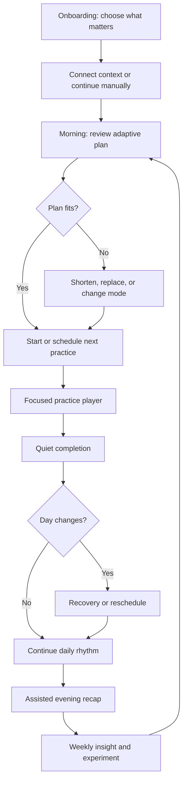

# 56 - Proactive Experience Conceptual Wireframes

## Purpose

These wireframes define information hierarchy, states, and decisions. They are
not a final visual design and should not be implemented pixel-for-pixel before
prototype validation.

## End-To-End Journey



## Mobile: Onboarding

```text
+----------------------------------+
| Sadhana OS                       |
|                                  |
| What should your practice        |
| protect in your life?            |
|                                  |
| [ Calm under pressure        ]   |
| [ Presence with family       ]   |
| [ Consistent inner practice  ]   |
| [ Physical vitality         ]    |
| [ Focus and meaningful work ]    |
|                                  |
| Choose up to two                 |
|                                  |
|              [Continue]          |
+----------------------------------+
```

Later steps:

- choose preferred practice language: Traditional, Balanced, or Secular;
- choose realistic morning and evening windows;
- choose Full, Balanced, and Minimum duration ranges;
- review notification boundaries;
- connect calendar in availability-only mode or continue manually;
- preview the first plan before saving.

Do not ask for health, location, microphone, and calendar permissions in one
sequence.

## Mobile: Today 2.0

```text
+----------------------------------+
| Good morning, Manoj              |
| Thursday, 23 July                |
|                                  |
| INTENTION                        |
| Be fully present                 |
|                                  |
| BALANCED PLAN                    |
| 24 minutes across 3 practices    |
| [Full] [Balanced] [Minimum]      |
|                                  |
| NEXT                             |
| 5-minute grounding               |
| Before your 10:00 meeting        |
|                                  |
| Your morning is meeting-heavy,   |
| so meditation moved earlier.     |
| [Why this?]                      |
|                                  |
| [ Begin practice ]               |
| [Schedule] [Shorten] [Replace]   |
|                                  |
| TODAY'S RHYTHM                   |
|  08:45 Grounding       Next      |
|  13:00 Mindful meal    Planned   |
|  20:30 Evening close   Flexible  |
|                                  |
| [Open full practice library]     |
|                                  |
| Today Practice Insights Journal  |
+----------------------------------+
```

### Required States

- no context connected;
- plan generating;
- balanced plan ready;
- meeting conflict detected;
- all planned practices complete;
- no practices completed;
- offline with last confirmed plan;
- sync error with retry;
- reduced-motion mode;
- unknown yesterday recap pending.

## Desktop: Today 2.0

```text
+----------+----------------------+-----------------------+
| Sadhana  | Good morning, Manoj  | Context               |
|          |                      |                       |
| Today    | Intention            | Calendar load: High   |
| Practice | Be fully present     | Energy: User says 3/5 |
| Insights |                      | Data sources          |
| Journal  | NEXT PRACTICE        | Calendar availability |
| You      | 5-min grounding      | Manual energy         |
|          | [Begin]              |                       |
|          | [Schedule] [Adjust]  | [Manage context]      |
|          |                      |                       |
|          | Daily rhythm         | Carry forward         |
|          | 08:45 Grounding      | Evening closure has   |
|          | 13:00 Mindful meal   | moved twice this week |
|          | 20:30 Evening close  | [Review suggestion]   |
+----------+----------------------+-----------------------+
```

Desktop uses three purposeful panes. It does not display the mobile cards in a
wider two-column grid.

## Plan Adjustment

```text
+----------------------------------+
| Adjust today's plan              |
|                                  |
| The 18:00 practice now conflicts |
| with a calendar event.           |
|                                  |
| ( ) Move to 20:30                |
| ( ) Use the 3-minute version     |
| ( ) Carry it to tomorrow         |
| ( ) Remove from today            |
|                                  |
| This changes today only.         |
|                                  |
| [Cancel]             [Update]    |
+----------------------------------+
```

The product must not silently reschedule a personal practice after a conflict.

## Guided Practice Player

```text
+----------------------------------+
| [Close]             Grounding    |
|                                  |
|                                  |
|             03:00                |
|                                  |
|       Follow a comfortable       |
|          breathing pace          |
|                                  |
|             [Pause]              |
|                                  |
| Haptics: On       Sound: Soft    |
|                                  |
|                     [Finish]     |
+----------------------------------+
```

Completion:

```text
+----------------------------------+
| Practice complete                |
|                                  |
| Take a moment before moving on.  |
|                                  |
| How do you feel now?             |
| [Settled] [Same] [Activated]     |
| [Not sure]                       |
|                                  |
| Add a reflection (optional)      |
|                                  |
|                      [Done]      |
+----------------------------------+
```

Do not use confetti, rankings, or inflated praise.

## Contextual Intervention

```text
+----------------------------------+
| A small pause?                   |
|                                  |
| You have 8 minutes before your   |
| next meeting.                    |
|                                  |
| Try a 3-minute grounding         |
| practice.                        |
|                                  |
| [Begin]              [Not now]   |
|                                  |
| Why this appeared                |
| Turn off prompts like this       |
+----------------------------------+
```

The explanation opens:

```text
This appeared because you allowed Sadhana OS to use calendar
availability. Event titles were not read or stored.
```

## Assisted Evening Recap

```text
+----------------------------------+
| Close the day                    |
| About 45 seconds                 |
|                                  |
| OBSERVED                         |
| [x] Grounding - Sadhana timer    |
| [?] Mindful meal - no record     |
| [x] Walk - Health integration    |
|                                  |
| Did the mindful meal happen?     |
| [Yes] [No] [I do not remember]   |
|                                  |
| Your state now                   |
| [Calm] [Tired] [Restless] [...]  |
|                                  |
| One thing worth carrying forward |
| [____________________________]   |
|                                  |
| [Write more in Journal]          |
| [Complete recap]                 |
+----------------------------------+
```

The recap never converts an unknown item to failure without a user's answer.

## Weekly Insight

```text
+----------------------------------+
| Your week                        |
| 17-23 July                       |
|                                  |
| Earlier practice was easier to   |
| keep on meeting-heavy days.      |
|                                  |
| Evidence                         |
| 5 comparable days               |
| 4/5 morning practices completed  |
| 1/5 evening practices completed  |
|                                  |
| This is a pattern, not proof of  |
| cause.                           |
|                                  |
| Try next week                    |
| Move evening closure to 17:30 on |
| high-meeting days.               |
|                                  |
| [Try experiment] [Not now]       |
|                                  |
| Was this useful? [Yes] [No]      |
+----------------------------------+
```

## Practice Library

The current category and habit model moves here.

```text
+----------------------------------+
| Practice Library                 |
| [Search]                         |
|                                  |
| Your priorities                  |
| Meditation            5-20 min   |
| Mindful speech        1-3 min    |
| Family presence       Flexible   |
|                                  |
| Explore                          |
| Inner practice                   |
| Body and vitality                |
| Relationships                    |
| Work and contribution            |
|                                  |
| [Manage custom practices]        |
+----------------------------------+
```

Tracking types, categories, archive/restore, and audit history remain
available, but configuration is not the first daily experience.

## Integration And Privacy Center

```text
+----------------------------------+
| Context and privacy              |
|                                  |
| Calendar                         |
| Availability only        On      |
| Event titles             Never   |
| Practice blocks          Ask     |
| [Manage] [Disconnect]            |
|                                  |
| Health                            |
| Not connected                    |
| [Learn before connecting]        |
|                                  |
| Proactive prompts                |
| Morning plan             On      |
| Practice reminder        One/day |
| Evening recap            On      |
| Contextual prompts       Off     |
|                                  |
| AI memory                        |
| No memories stored               |
| [Review controls]                |
+----------------------------------+
```

## Missing, Offline, And Error Behavior

### Missing Context

```text
No energy check-in is available.
[Add a quick check-in] [Use Balanced plan]
```

### Offline

```text
Showing the plan last confirmed at 8:12 AM.
You can continue practice offline. Changes will sync when connected.
```

### Integration Failure

```text
Calendar availability could not refresh.
Your existing plan has not changed.
[Try again] [Continue without calendar]
```

### Recommendation Unavailable

```text
Sadhana OS could not prepare a recommendation.
Your Practice Library and saved plan are still available.
[Open saved plan] [Try again]
```

No blank screen or indefinite loading state is acceptable.

## Prototype Validation Checklist

- The next action is visible without scrolling on common mobile viewports.
- The recommendation reason is available without navigating to Settings.
- Every proactive prompt has Skip and control access.
- Observed, confirmed, suggested, and unknown states are visually and verbally
  distinct.
- Desktop uses adaptive panes.
- Practice Player removes unrelated navigation.
- Evening recap can be completed without writing text.
- Privacy controls explain benefit and scope before permission.
- Error states preserve a usable manual path.
- The full loop can be tested without connecting real health data.
